#HSLIDE

## API Creation to Iteration
### Without the Frustration

#VSLIDE?image=assets/images/golden-gate.jpg

### Steve Rice
##### web development: frontend, backend, APIs
##### API Captain at <span class="pd-green">PagerDuty</span> in San Francisco

#VSLIDE?image=assets/images/pagerduty_brand_stamp.png

## What is PagerDuty?

- incident resolution platform <!-- .element: class="fragment" -->
- triage events <!-- .element: class="fragment" -->
- manage incident response <!-- .element: class="fragment" -->
- Rails, MySQL, Scala, Cassandra, Kafka, etc. <!-- .element: class="fragment" -->
- Backbone, Ember.js, Android + iOS <!-- .element: class="fragment" -->

#VSLIDE

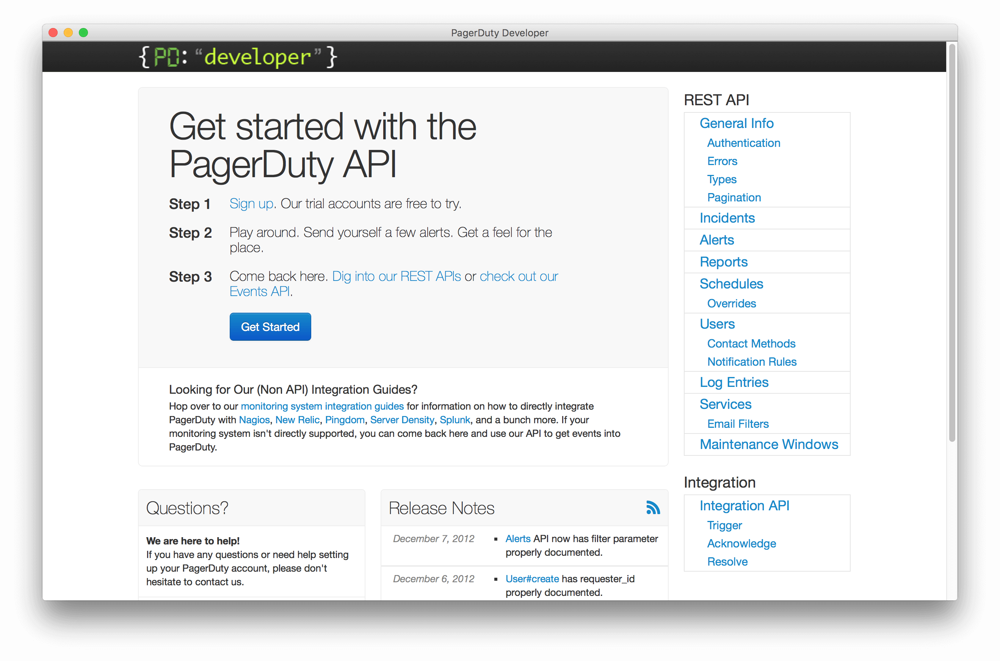
<figcaption>https://web.archive.org/web/20130116145245/http://developer.pagerduty.com/</figcaption>

<!--
Having a public API has always been important to PagerDuty. Since we don't provide any value unless you can feed data to us from monitoring tools, we've always needed an API for those tools to talk to.
-->

#VSLIDE

```ruby
# This controller is for communication between the main app
# server and other processes in the system. The idea here is
# that this shouldn't be exposed to the outside world.
```

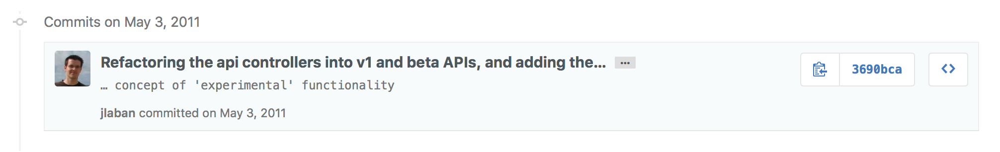

<!--
And for a long time, we've powered product behavior with simple JSON APIs. Internally, services began to communicate in this manner, but as more external clients like our client-side JavaScript experience and our mobile apps needed ways to talk to the backend, we were developing APIs at a higher level to provide all of the basic data acess and manipulation required by our frontend.
-->

#VSLIDE

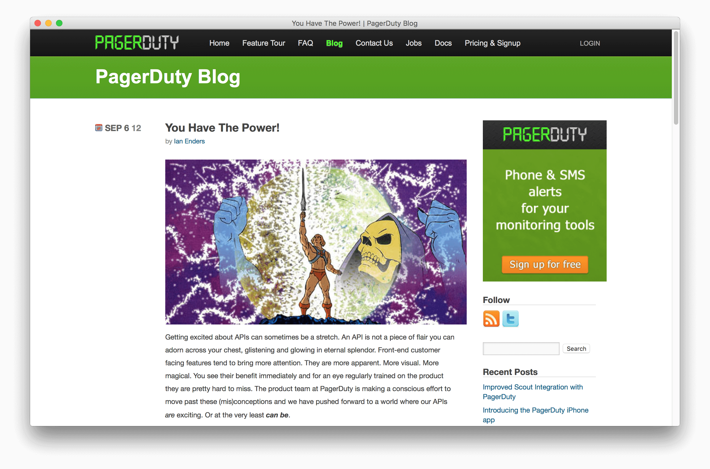
<figcaption>https://web.archive.org/web/20130312085114/http://blog.pagerduty.com/2012/09/you-have-the-power/</figcaption>

<!--
It wasn't much of a leap, then, to publish the same APIs we'd been using to implement product features so that our customers could do interesting things with them on their own.
This led us to a culture of "publish every API" — which is a great sentiment, but has its downsides if you're not careful.
-->

#VSLIDE

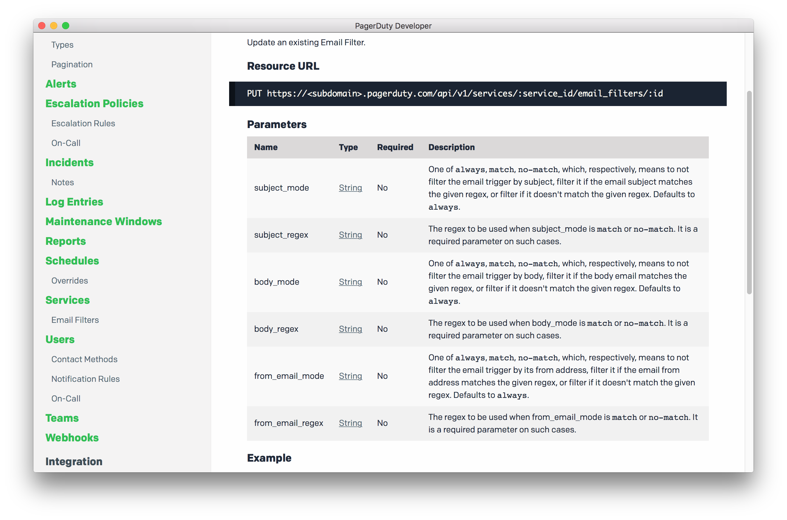

<!--
When making an API endpoint is a requirement to implement a feature, and making it public is automatic, you can easily end up with a series of disjoint API endpoints whose implementation focused more on getting something functional out the door than considering the developer experience.
-->

#HSLIDE

# Research

<!--
As with any project, the first thing to do is gather information. Figure out what you want to do with your new API version. Chances are, there are some things about the current version you aren't too happy with, so start by finding better ways and identifying problems you didn't even realize existed.
-->

#VSLIDE?image=assets/images/turtles.jpg

## Stand on the Shoulders of Giants

<!--
APIs are not new; people have been working on this stuff for decades. Especially when the goal of your technology is to interoperate, it pays to leverage the best practices happening in the space.
-->

#VSLIDE?video=assets/videos/amber-feng.mp4

## Conferences and Talks

<figcaption>https://www.heavybit.com/library/video/move-fast-dont-break-api/</figcaption>
<figcaption>http://amberonrails.com/move-fast-dont-break-your-api/</figcaption>

<!--
Talks are a great way to get ideas and get out of your day-to-day headspace.
You're here, so you're off to a good start!
This talk by Amber Feng at Stripe, entitled "Move Fast, Don’t Break the API", set me up with some great ideas about how to manage multiple versions of an API on a technical level.
-->

#VSLIDE?image=assets/images/dropbox-blog.png

## Developer Blogs

<figcaption><a href="https://blogs.dropbox.com/developers/2015/04/a-preview-of-the-new-dropbox-api-v2/" style="color: white">https://blogs.dropbox.com/developers/2015/04/a-preview-of-the-new-dropbox-api-v2/</a></figcaption>

<!--
A large part of your change is going to involve publicity. So read up, and find good work by others in the space.
This post by Leah Culver at Dropbox was a great example of how to be concise and helpful when talking about a new API version.
-->

#VSLIDE

- HAL: http://stateless.co/hal_specification.html
- OData: http://www.odata.org
- Collection+JSON: https://github.com/collection-json/spec
- JSON-API: http://jsonapi.org
- JSON-LD: http://json-ld.org
- GData: https://developers.google.com/gdata/
- GraphQL: http://graphql.org
- Siren: https://github.com/kevinswiber/siren

<figcaption>https://sookocheff.com/post/api/on-choosing-a-hypermedia-format/</figcaption>

<!--
Protocols/media types like OData, JSON API, GData, or GraphQL, Siren have done a lot of the standardization work for you so there are fewer decisions left to be made, but be aware of the tradeoffs. Remember that REST is an architectural style, not a protocol — you'll end up developing your own. I said "fewer" because you'll still need to make application-specific choices, but reducing the scope of these can help maintain sanity.
-->

#HSLIDE

# Plan

#VSLIDE?image=assets/images/bike-shed.jpg

## Make decisions.

<!--
Design requires decision-making. Especially when it comes to things that on the surface appear purely aesthetic (like an API), everyone will have input.
In some technical areas, it can be quite valuable to have a decision maker whose head is in the game and can make a final call and move on.
Even better, outsource your decisions if possible.
-->

#VSLIDE

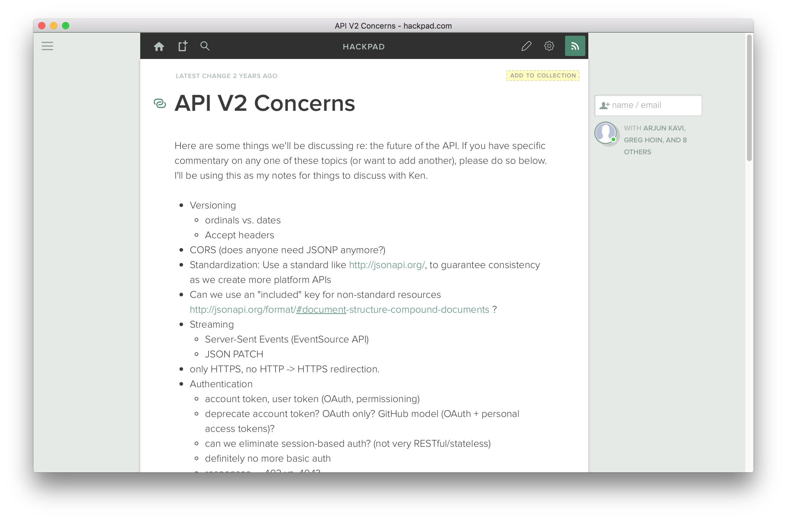

<!--
To kick off PagerDuty API v2, I gathered input from a number of sources:
- the commonalities in our existing API documentation
- what made for clean code and what didn't (experience + analysis)
- discussions with colleagues and interested parties
- feature requests and customer support: what was causing people pain?
-->

#VSLIDE?image=assets/images/pygerduty.png

## Go to the Source

<figcaption style="color: white">https://github.com/dropbox/pygerduty</figcaption>

<!--
Go to the source — literally. We're fortunate enough to have a large community of developers who write and publish code for talking to the PagerDuty APIs in a variety of languages. Looking at this code can give you a fresh perspective on how developers are interpreting your API's documentation and patterns, helping you look for where developers need to jump through hoops and you could perhaps provide a better experience.
-->

#VSLIDE?image=assets/images/pour-over.jpg

## Pour over logs

- which endpoints aren't being used?
- which endpoints are being used in ways they shouldn't?
- which customers are using the APIs?

<!--
A big advantage you have over developing a brand new API is tons of data about your existing API and how people use it. So leverage that data — go through your logs and build reports on which endpoints are popular, which are neglected, what the common patterns are of requests being made, what developers are trying to do with your API that appears painful.
Talking to your developers directly is valuable, don't neglect that; but make sure you take a look at the big overall picture so you don't end up narrowing in on the specifics of certain developers.
-->

#VSLIDE?gist=e33e5d401e5f8fa9e260ba1b7a20bdd2

<!--
The result was this: an "API v2 vision" that describes the goals of the new API version and the specifics of the patterns we were to formalize.
-->

#VSLIDE

## Pick your Battles

- Don't change what works <!-- .element: class="fragment" -->
- Prioritize <!-- .element: class="fragment" -->
- Keep bullets away from feet <!-- .element: class="fragment" -->

<!--
When you're working on a new version of your API, you're fighting a war on two fronts: your developers will need to work to adopt, and your company will need to provide the time and resources to make it happen. So focus only on what's most important and will make a meaningful difference for yourselves and your developers.
At PagerDuty, our API is a key competitive differentiator. When we can say to customers, "sure, you can do that with the API", it has real results. Building an ecosystem makes those conversations even easier; enabling developer productivity is the #1 goal.
But there's a secondary motivation. Designing APIs is tough. Designing an API to last 10 years is nearly impossible without change. You need to address the decisions that were fine when they were made but are now causing performance, scaling, or quality issues.
-->

#VSLIDE

## Highlights

- header- and key-based versioning <!-- .element: class="fragment" -->
- canonical API subdomain <!-- .element: class="fragment" -->
- use standards <!-- .element: class="fragment" -->
- deprecate basic auth <!-- .element: class="fragment" -->
- performance tweaks <!-- .element: class="fragment" -->
- consistency <!-- .element: class="fragment" -->

<!--
register media type under vendor tree with IANA
schema consistency, path consistency, parameter consistency, response consistency
-->

#VSLIDE

## Change the Plan

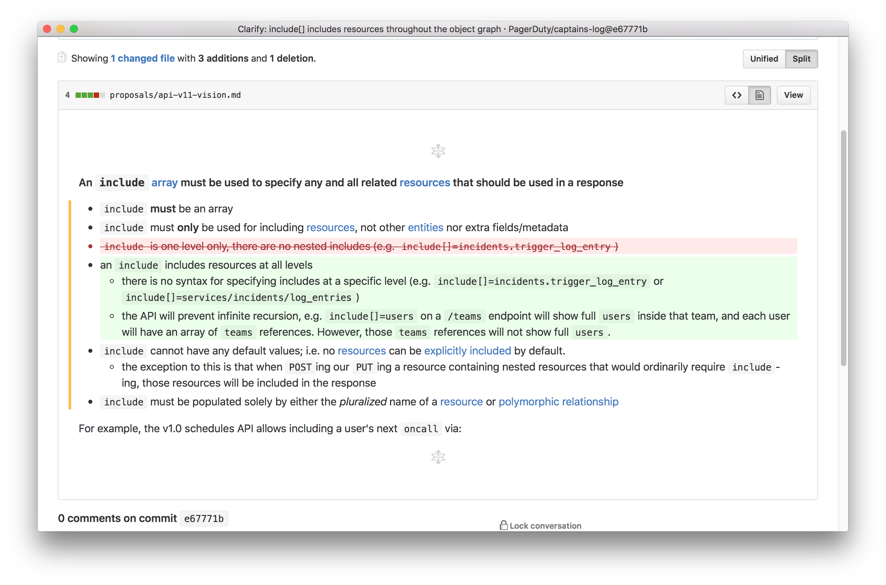

<!--
As you develop, things will change. You'll find where your patterns break down. You'll see where you need something different. Other smart people will question your choices.
Don't ignore these inputs; adapt to them. Have a process that encourages change instead of blocking it.
-->

#VSLIDE?image=assets/images/api-concerns-proposal.png

## Process is Paramount

<!--
The most difficult part of maintaining an API is adapting to change. We need to strike a balance between building new and shiny things and preventing thrash for our developers. As consistency is one of the main tenants of our API, a big challenge was, and remains, keeping new development in line with the API goals without standing in the way of progress.
Originally, we had an email list that we'd use to discuss new API changes. It was common knowledge among the engineers that if you wanted to make an API change, it would need to be proposed to the email group where our API Czar sat. But this was slow, cumbersome, and difficult to make sure the right discussion happened and translated into the proper course of action.
-->

#VSLIDE?gist=2109c70ecff5b71d8bc0a072760b03fe

<!--
So we used a tool that our developers were already familiar with: GitHub. Contributors can now write in Markdown, comment on specific lines within the proposal, and have the back-and-forth type of review discussion that GitHub facilities. Familiar GitHub semantics like merging a pull request to indicate finality and version tracking to see how a proposal evolved gives much more context of the past and current state of a proposal. Plus, nice things like the abilitiy to link directly to something being discussed.
-->

#VSLIDE

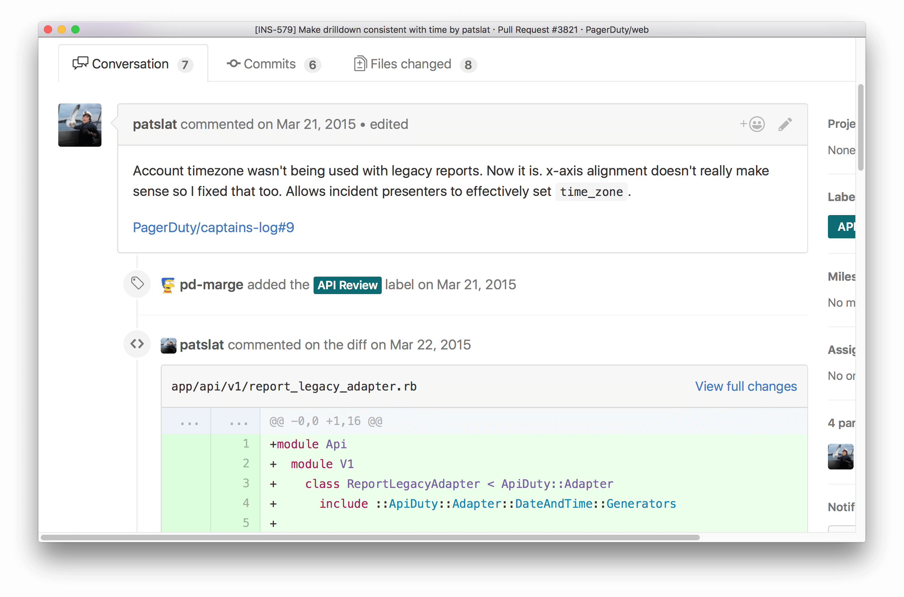
<figcaption>https://github.com/PagerDuty/flagger</figcaption>

<!--
In practice, this still needs refinement. One of the big challenges is making sure that people are doing this diligence when they need to be. It's difficult enough to get dozens of engineers to buy into a new process; even moreso when they're often unaware they need to participate.

Here's one thing we experimented with: using knowledge of our Rails codebase to flag pull requests making changes to API code for further review.
-->

#HSLIDE

# Document

#VSLIDE

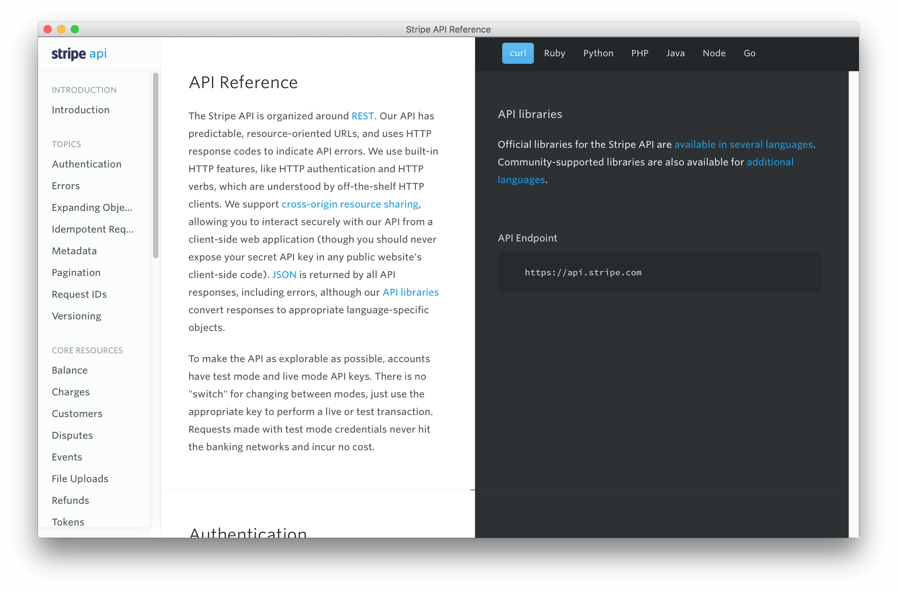
<figcaption>https://stripe.com/docs/api</figcaption>

#VSLIDE?image=assets/images/maintainable.jpg

## Keep it maintainable

#VSLIDE?gist=956f25b0d2c3f064c278529fc475da18

#VSLIDE

## Choose domain-specific technologies


#VSLIDE?gist=44dca2fec85c13810f1c102bacedfa1e

#VSLIDE?image=assets/images/remember-the-humans.jpg

## Consider the Humans

#VSLIDE?image=assets/images/swagger-docs.png

## Make it interactive

#VSLIDE?image=assets/images/v2-migration-guide.png

## Remember your audience

#HSLIDE

# Develop

#VSLIDE

## Keep it Simple

```ruby
class Api::V2::EscalationPolicyAdapter::Base < ApiDuty::Adapter
  root_attribute :escalation_policy

  validate :name, validator: :is_string
  validate :escalation_rules, validator: :is_array
  validate :description, validator: :is_string
  validate :num_loops, validator: :is_integer
  validate :teams, validator: :is_array
  validate :teams, validator: make_validator_each(
      make_validator_object_resource(%w(team).freeze)
    )

  passthrough :name, :description
  generate :num_repeats, from: :num_loops do |num|
    num.to_i + 1
  end
  generate :escalation_policies_teams_attributes,
    from: :teams, generator: :teams_join_params
  generate :escalation_policies_teams_attributes,
    from: :teams, generator: make_generator_default([])
end
```

#VSLIDE

## Keep it Simple

```ruby
module Api
  module V2
    class SchedulesController < Api::V1::SchedulesController
    end
  end
end
```

<!--
Schedules controller inheritance
-->

#VSLIDE?image=assets/images/farfalle.jpg

## Be pragmatic

### DRY is not a god

```ruby
def unwrapped_incident_json
  # V2+: incident object is wrapped.
  json[:incident]
end

def assert_assigned_to_user(json, user)
  # V2+: assigned_to_user is removed
  assert_not_include json.keys, 'assigned_to_user'
end

def assert_reassigned_to_user(json, user)
  # V2+: assigned_to_user is removed
  assert_not_include json.keys, 'assigned_to_user'
end

def assert_incident_count(expected, json)
  assert_equal(expected, json)
end

def assert_ile_request_method(incident, request_method)
  incident.clear_les_log_entries
  ile = incident.les_log_entries(limit: 1).last
  assert_equal request_method, ile.request_method
end
```

<!--
DRY is not a god
-->

#HSLIDE

# Test

#VSLIDE?image=assets/images/dogfood.jpg

# Dogfood. Everything.

#VSLIDE

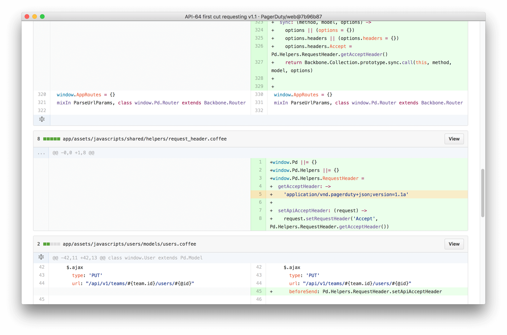

<!--
A huge advantage to using your own API is that you don't need to make a single enormous, scary change.
One of the most beneficial things we did at PagerDuty was set up our v2 API to work exactly like our v1 API, then iterate piece by piece on the changes we needed to make it compliant with the new version goals.
At the very beginning, then, we switched our internal clients to use the new API version. As we made changes, we'd immediately be implementing them in clients at the same time so we could tell right away if a change didn't make sense or was more difficult to work with than we'd anticipated.
-->

#VSLIDE

## Automate


#VSLIDE

## Trust, but Verify

```ruby
def self.compare_json(old, new, consider_ordering = false)
  return true if old == new

  old, new = *[old, new].map(&JSON.method(:parse))

  unless consider_ordering
    # Recursively sort hash keys so the diff ignores ordering
    original = self.sort_recursively(original)
    modified = self.sort_recursively(modified)

    # Quick test, in case the sorted hashes are equal
    return true if original == modified
  end
  return false
end
```

#HSLIDE

# Connect

#VSLIDE

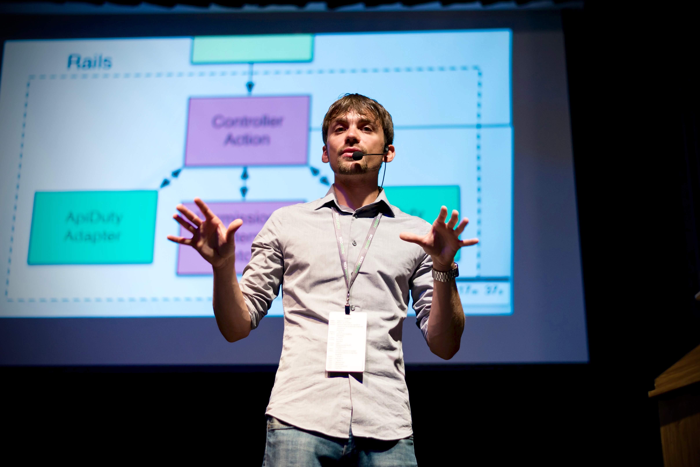

#VSLIDE

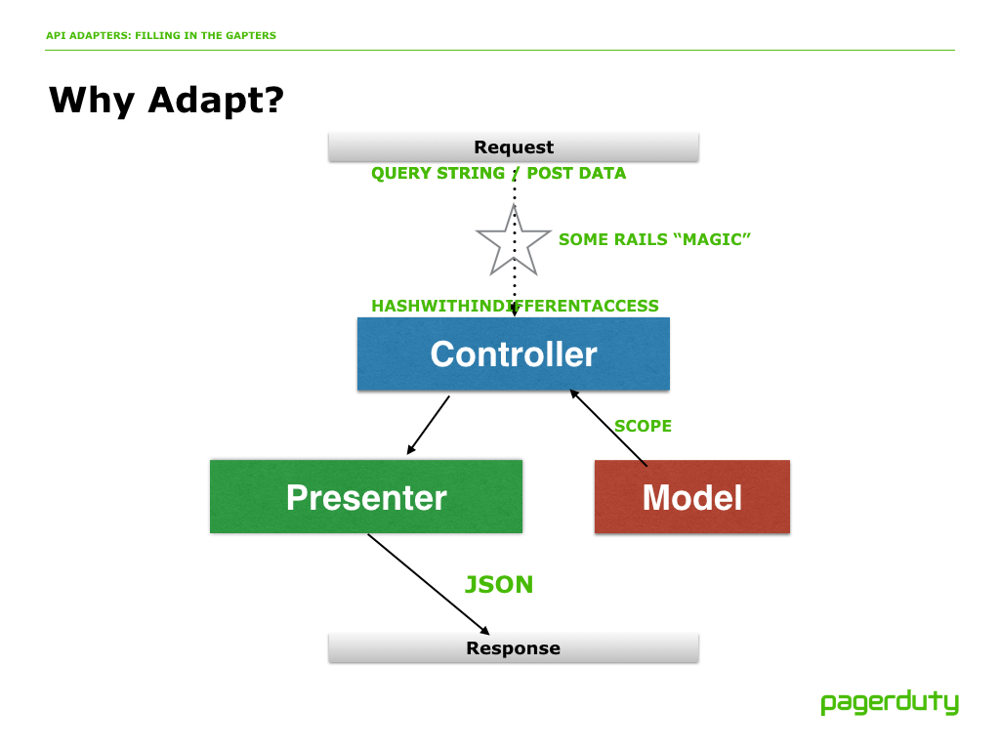

#VSLIDE?gist=a44681b325f3cc92c02cad3ed12e157e

<!--
Basic auth deprecation letter
-->

#VSLIDE?gist=7fec9b36bf0bd609204f6614fb5717f3

<figcaption>https://www.pagerduty.com/blog/pagerduty-api-v2-now-in-beta/</figcaption>

<!--
Here's the announcement
-->

#VSLIDE

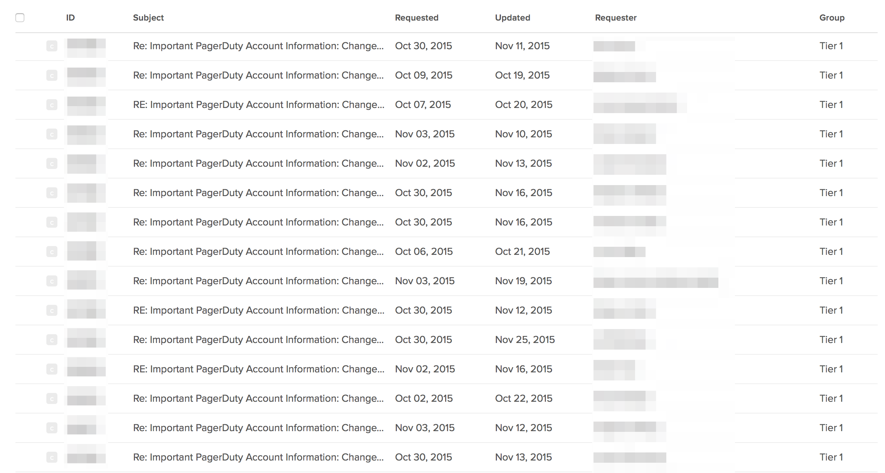

#HSLIDE

# Market

#VSLIDE

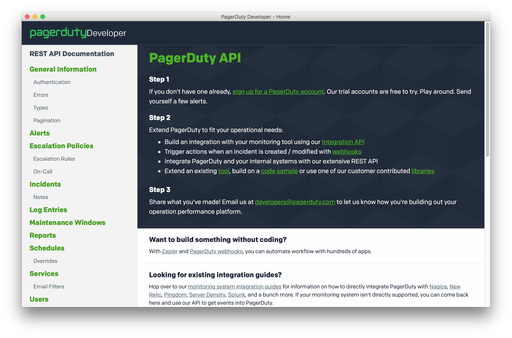

#VSLIDE

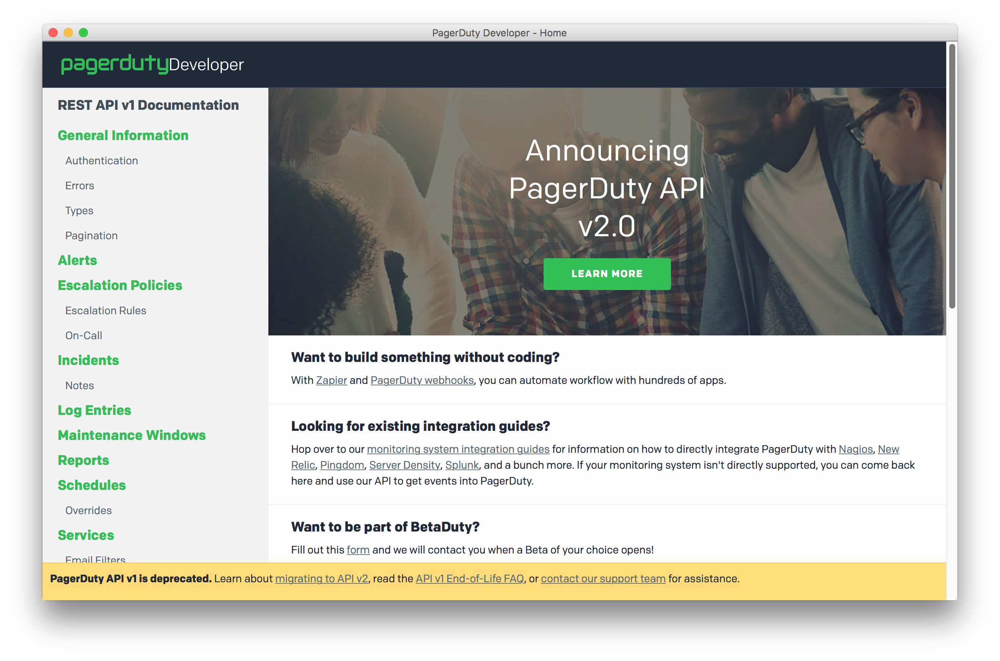
<figcaption>https://v1.developer.pagerduty.com/</figcaption>

#VSLIDE

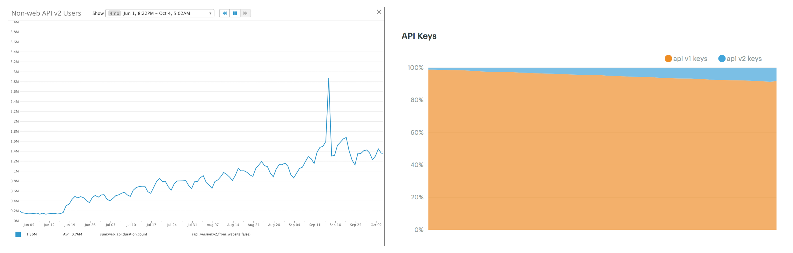

#HSLIDE

# What's next?

#VSLIDE

## Deprecation

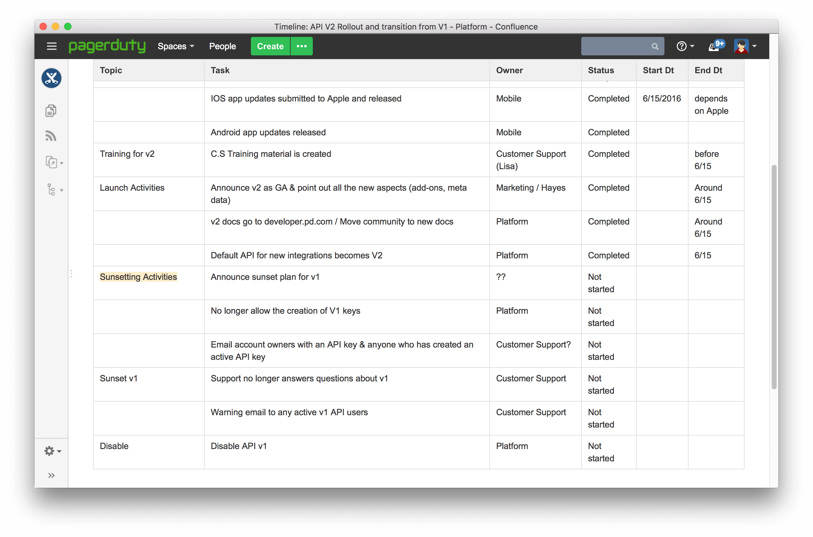

#VSLIDE

## BFF

#VSLIDE

## Moar Integrations

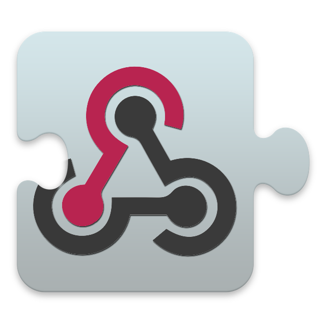

#HSLIDE?image=assets/images/never-ending-story.jpg

# Fin?

#HSLIDE

# Q&A

#HSLIDE

# Appendix

#VSLIDE

## Image Credits

- "Steve Rice" By Steve Rice © 2016 (Own work), all rights reserved
- "Stand on the Shoulders of Giants" By Samir Eberlin [CC0], via Wikimedia Commons — https://commons.wikimedia.org/wiki/File:Turtles.on.a.stone.in.brazil.jpg
- "Make Decisions." By SeppVei (Own work) [CC0], via Wikimedia Commons — https://commons.wikimedia.org/wiki/File:Bicycle_shed.JPG
- "Be Pragmatic" By Liveon001 © Travis K. Witt (Own work) [CC BY-SA 3.0 (http://creativecommons.org/licenses/by-sa/3.0) or GFDL (http://www.gnu.org/copyleft/fdl.html)], via Wikimedia Commons — https://commons.wikimedia.org/wiki/File:Farfalle_Pasta.JPG
- "Dogfood. Everything." Original source not found. Used without permission.
- "Keep it maintainable" By David Jones from Isle of Wight, United Kingdom [[CC BY 2.0](http://creativecommons.org/licenses/by/2.0)], via Wikimedia Commons — https://commons.wikimedia.org/wiki/File:Mike_O%27Callaghan-Pat_Tillman_Bridge_construction.jpg
- "Pour over logs" by Timothy Marsee [[CC BY 2.0](http://creativecommons.org/licenses/by/2.0)], via Flickr — https://www.flickr.com/photos/tmarsee530/9899684046
- "BFF" By Guillaume Paumier (Own work) [CC BY-SA 3.0 (http://creativecommons.org/licenses/by-sa/3.0)], via Wikimedia Commons — https://commons.wikimedia.org/wiki/File:Best_Frends_Forever_-_Golden_Gate_bridge_guard_rail_166.jpg
- "Fin?" Copyright 1984 Warner Bros. Pictures, via Cinema Autopsy — https://blog.cinemaautopsy.com/2013/04/02/film-review-the-neverending-story-1984/