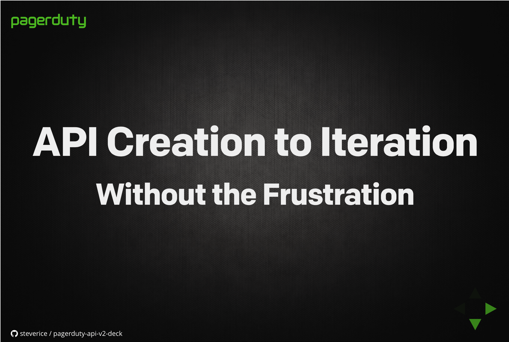

# API Creation to Iteration: Without the Frustration

A presentation on the process behind developing [PagerDuty's API v2](https://developer.pagerduty.com). Made with [GitPitch](https://gitpitch.com).

